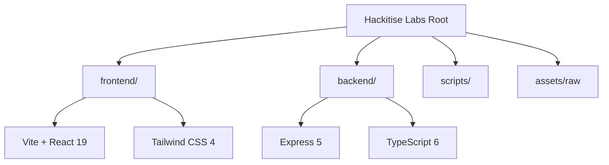

# 🛡️ Hackitise Labs - Enterprise Cybersecurity Platform

[](https://hackitise.com)
[](https://github.com/Akhilesh-raje/hackitise-labss)
[](https://github.com/Akhilesh-raje/hackitise-labss/graphs/commit-activity)

Welcome to the **Hackitise Labs** official platform. This repository houses the complete ecosystem for our cybersecurity firm, including a high-performance marketing frontend and a robust TypeScript-based API service.

---

## 🏗️ Monorepo Architecture

This project is organized as a high-performance monorepo using **npm workspaces**. This setup ensures seamless integration between the client-facing platform and the administrative backend.



### 📁 Directory Roadmap

- **[frontend/](file:///c:/Users/rajea/Documents/hakesite%20-%20Copy/frontend/)**: Modern React application with Framer Motion for high-end aesthetics.
- **[backend/](file:///c:/Users/rajea/Documents/hakesite%20-%20Copy/backend/)**: Scalable Express service built with enterprise-grade TypeScript.
- **[scripts/](file:///c:/Users/rajea/Documents/hakesite%20-%20Copy/scripts/)**: Development utilities and automation scripts.
- **[assets/](file:///c:/Users/rajea/Documents/hakesite%20-%20Copy/assets/)**: Source design assets and branding components.

---

## 🚀 Getting Started

### Prerequisites
- **Node.js**: v18.0.0 or higher
- **npm**: v9.0.0 or higher

### Installation
Clone the repository and install dependencies from the root:
```bash
npm install
```

### Development Environment
Launch the full stack (Frontend & Backend) concurrently:
```bash
npm run dev
```
- **Frontend**: [http://localhost:5173](http://localhost:5173)
- **Backend**: [http://localhost:4000](http://localhost:4000)

---

## 🛠️ Technology Ecosystem

### Core Frontend
- **Framework**: React 19 (Vite)
- **Styling**: Tailwind CSS 4 (Custom Neo-Cyber Design)
- **Animations**: Framer Motion 12
- **Icons**: Lucide React
- **Routing**: React Router 7

### Core Backend
- **Engine**: Express 5
- **Language**: TypeScript 6
- **Runtime**: tsx (Unified dev execution)
- **API**: RESTful Architecture

---

## 🛡️ Cybersecurity Mission

**Hackitise Labs** is dedicated to fortifying the digital perimeter. Our platform is designed to be as secure as the systems we protect.

> "Our mission is to provide enterprise-grade security solutions with a seamless, high-performance user experience."

---

## 🤝 Collaboration & Support

Developed with ⚡ by the **Hackitise Labs Engineering Team**.

For module-specific documentation:
- 🌐 [Frontend Documentation](file:///c:/Users/rajea/Documents/hakesite%20-%20Copy/frontend/README.md)
- ⚙️ [Backend Documentation](file:///c:/Users/rajea/Documents/hakesite%20-%20Copy/backend/README.md)

---
© 2026 Hackitise Labs. All rights reserved.
